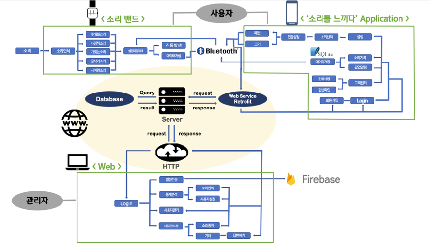
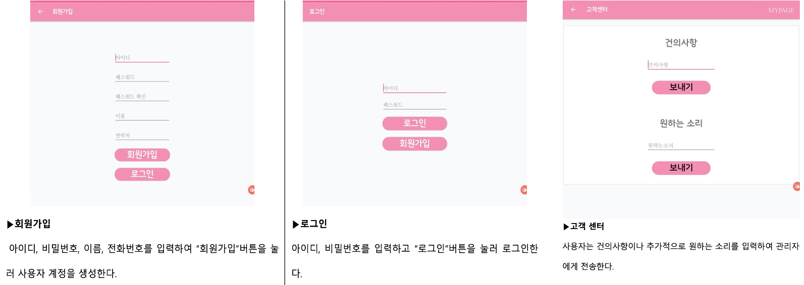

# 'Feel the Sound' Integrated System for hearing-impaired people   청각 장애인을 위한 '소리를 느끼다' 통합 시스템
 This is an integrated system for hearing-impaired people that quickly recognizes and informs the sounds that occur in dangerous situations.

## Motive
 According to the International Association for Persons with Disabilities, 60% of persons with disabilities cannot recognize and judge accidents when they occur. In particular, hearing-impaired people are exposed to many dangerous situations in blind spots that are beyond sight. 
This project was initiated to help hearing-impaired people could respond quickly in these situations.

## System Architecture
 There are three main components of this system. It is the 'Sound Band(IoT product)' which detects the danger and informs the user, User Application(android) and Web Pages for Administrators.

## Sound Band(IoT product)
#### Function
* Sound Recognition & Notification
* Types of perceived sounds: Baby crying, car honking, dog barking, excavators, sirens
* Send the perceived sound type and time data to the User Application.   

  
## User Application(android)
#### Function
* Control the 'Sound band' 
  * Set the sound you want to recognize
  * Vibration settings (pattern, size)
* Record the generated sound information
* Customer Center

## Web Pages for Administrators
#### Function
* Send an announcement
* Data Statistics Analysis
* User management
* Check user suggestions

